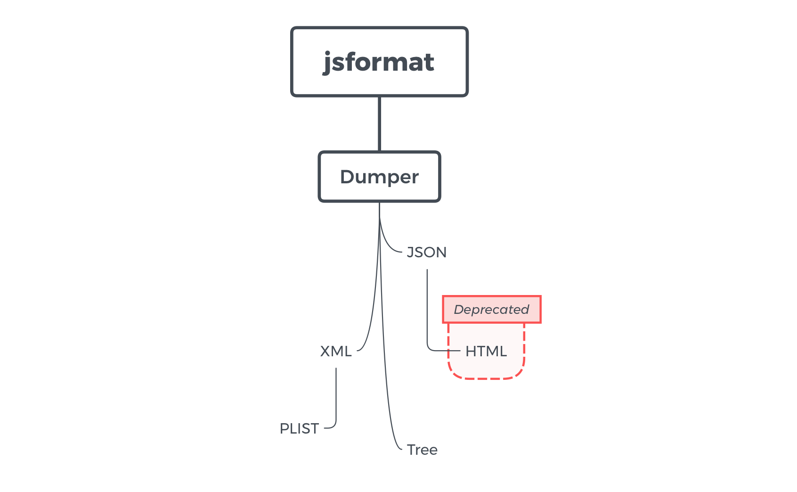

# jsformat

&emsp; The `jsformat` project is an open source Python program works as a stream formatted output dumper.

- [About](#about)
    * `jsformat.Dumper`
    * `jsformat.JSON`
    * `jsformat.PLIST`
    * `jsformat.Tree`
    * `jsformat.XML`
    * `jsformat.HTML`
- [Installation](#installation)
- [Usage](#usage)

---

### About

&emsp; Currently, it supports following formats --

 - `jsformat.Dumper` -- abstract base class of all dumpers
 - `jsformat.JSON` -- dump JavaScript object notation (`JSON`) format file
 - `jsformat.PLIST` -- dump Apple property list (`PLIST`) format file
 - `jsformat.Tree` -- dump tree-view text (`TXT`) format file
 - `jsformat.XML` -- dump extensible Mmarkup language (`XML`) file (__base class__)
 - `jsformat.HTML` -- dump JavaScript file under `Vue.js` framework (__DEPRECATED__)



&nbsp;

### Installation:

> Note that `jsformat` only supports Python versions __since 3.0__

```
pip install jsformat
```

&nbsp;

### Usage

&emsp; `jsformat` is quite easy to use. After installation, importation, and initialisation, you can simple call the instance to dump contents.

> Take `jsformat.Tree` for example

```python
import jsformat
dumper = jsformat.Tree('out.txt')
test_1 = dict(
    foo = -1,                   # int
    bar = 'Hello, world!',      # string
    boo = dict(                 # dict
        foo_again = True,       # bool
        bar_again = b'bytes',   # bytes (b'\x62\x79\x74\x65\x73')
        boo_again = None,       # NoneType
    ),
)
dumper(test_1, name='test_1')
```
```
$ cat out.txt
PCAP File Tree-View Format

test
  |-- foo -> -1
  |-- bar -> hello
  |-- boo
        |-- foo_again -> True
        |-- bar_again -> 62 79 74 65 73
        |-- boo_again -> N/A
```
```python
import datetime
test_2 = dict(
    foo = [1, 2.0, 3],          # list
    bar = (1.0, 2, 3.0),        # tuple
    boo = dict(                 # dict
        foo_again = 'a long long bytes',
                                # bytes
        bar_again = datetime.datetime.today(),
                                # datetime
        boo_again = -1.0,       # float
    ),
)
dumper(test_2, name='test_2')
```
```
$ cat out.txt
PCAP File Tree-View Format

test_1
  |-- foo -> -1
  |-- bar -> Hello, world!
  |-- boo
        |-- foo_again -> True
        |-- bar_again -> 62 79 74 65 73
        |-- boo_again -> N/A

test_2
  |-- foo
  |     |--> 1
  |     |--> 2.0
  |     |--> 3
  |-- bar
  |     |--> 1.0
  |     |--> 2
  |     |--> 3.0
  |-- boo
        |-- foo_again -> a long long bytes
        |-- bar_again -> 2018-03-08 17:47:35
        |-- boo_again -> -1.0
```
